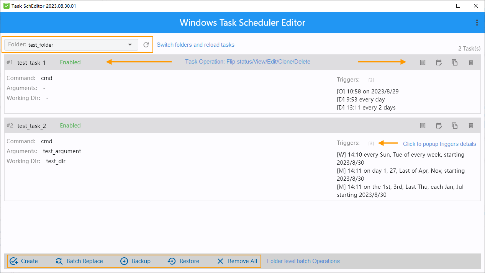

# Task SchEditor on Windows

Suppose you have dozens of scheduled tasks on hand and you have to maintain them occasionally with the following requirements: modify task command and arguments, change working directory to a new place, etc. This tool might be the one for you.

While all these operations can be done thru windows native task scheduler or bash/powershell scripts, we are trying to make it happen in a simple and straight forward way.

## Features

- Show task's major properties(action & triggers) in row-style format
- Task's Edit/Clone/Delete operations
- Batch replacement of task's action attributes
- Backup/Restore tasks of a folder

## Usage

Download the release file, unzip it to your local drive, locate file 'TaskSchEditor.exe' and double click it, there you go.

- goto the folder you are interested in
- find your task, view/edit/clone/delete it or flip its status
- backup all tasks configurations, retstore them into another folder or another host
- batch replacement support targeting on task action's command/arguments/working dir(aka 'Start in' field)

## Issues and feature requests

Any issues and feature requests are welcome.

- For all the subfolders of 'Task Scheduler Library', only the first level subfolders are listed in folder's dropdown list
- A task can have multiple actions defined in the system while we only support the first one
- Trigger types other than Onetime/Daily/Weekly/Monthly would be marked as 'not supported'
- Write operations such as edit/delete/replace might get failed because of privilege issue; run TaskSchEditor with admin privilege could resove the issue
- Do make a backup before important operations

